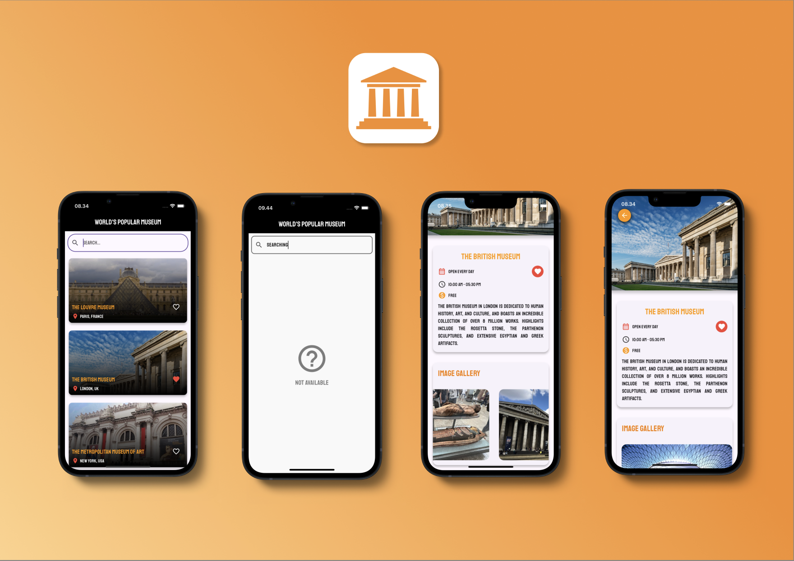

# 🌍 World's Famous Museums Flutter App

Welcome to my first-ever Flutter project! 🎉 and it's all about the world's famous museums! Inside, you'll find information about various museums, including descriptions, opening hours, days they're open, and ticket prices. Plus, on the museum detail page, there's a photo gallery to give you a closer look at each museum.

## 🖼️ What's Inside?

- **Museum Info:** Get detailed descriptions of each museum, including what makes them special.
- **Opening Hours:** Never miss a visit! Check out when each museum is open.
- **Open Days:** Plan your trip with ease by knowing the days each museum welcomes visitors.
- **Ticket Prices:** Budget your visit by checking out the ticket prices for each museum.
- **Photo Gallery:** Feast your eyes on stunning images of these world-renowned museums right from the detail page.

## 🎯 Why This App?

Because exploring museums should be as easy and fun as a few taps on your screen! Whether you're planning your next trip or just want to discover some cool places from your couch, this app has you covered.

## 📸 Screenshots

Here’s a sneak peek at what you can expect:

